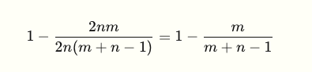

### GPipe

#### Interleaved GPipe

#### Bubbles

- 

- Increasing the number of microbatches m, is necessary for making the bubble fraction small; increasing the memory demand.
  As the number of micro-batches (m) increases relative to the number of GPUs (n), the bubble fraction (
  m
  n−1
  ​
  ) shrinks. This is why "flooding the pipe" with many small micro-batches is the key to high hardware efficiency in systems like GPipe.
  

#### Memory Demand

